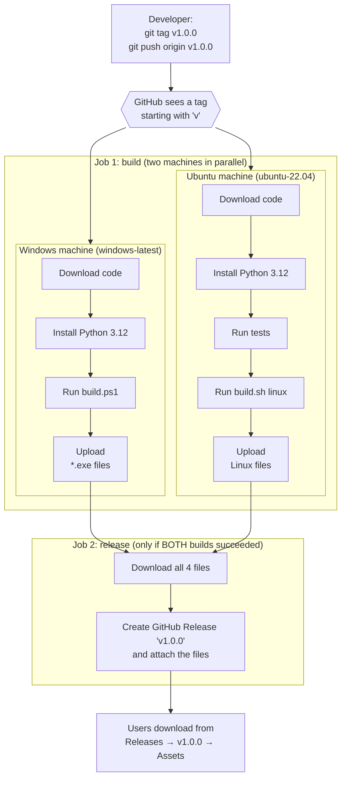

# Build and release pipeline (GitHub Actions)

This document explains how the project's GitHub Actions pipeline turns
the source code into the four ready-made programs users download:

| | CLI | Web UI |
|---|---|---|
| Windows | `media-downloader-cli.exe` | `media-downloader-ui.exe` |
| Ubuntu / Linux | `media-downloader-cli` | `media-downloader-ui` |

The pipeline is defined in
[`.github/workflows/release.yml`](../.github/workflows/release.yml).

---

## Contents

1. [What the pipeline is for](#1-what-the-pipeline-is-for)
2. [The big picture](#2-the-big-picture)
3. [When it runs (triggers)](#3-when-it-runs-triggers)
4. [Step-by-step: the `build` job](#4-step-by-step-the-build-job)
5. [Step-by-step: the `release` job](#5-step-by-step-the-release-job)
6. [The workflow file, line by line](#6-the-workflow-file-line-by-line)
7. [How to publish a release](#7-how-to-publish-a-release)
8. [Watching a run and finding the results](#8-watching-a-run-and-finding-the-results)
9. [When something fails](#9-when-something-fails)
10. [Why it's designed this way](#10-why-its-designed-this-way)
11. [Costs and limits](#11-costs-and-limits)
12. [Changing the pipeline](#12-changing-the-pipeline)
13. [Glossary](#13-glossary)

---

## 1. What the pipeline is for

The programs are built with **PyInstaller**, which packs Python, every
library, and FFmpeg into one file. PyInstaller has one hard rule:

> **It can only build for the operating system it runs on.** A Windows
> `.exe` must be built on Windows, and a Linux program on Linux.

Without the pipeline, a release would need a Windows PC and an Ubuntu
PC, a build on each, and the files uploaded by hand. The pipeline does
all of that on machines GitHub provides:

- **It builds on each system's own machine:** Windows files on
  Windows, Linux files on Ubuntu.
- **It tests before it releases:** if the tests fail, nothing is
  published.
- **It publishes automatically:** the four files are attached to a
  GitHub **Release**, where users download them.
- **Its builds are repeatable:** every release is built the same way,
  from exactly the tagged code, using the same `build.sh` / `build.ps1`
  a developer can run locally.

The finished programs are **not** stored in the git repository. Each is
about 160 MB, and GitHub rejects files over 100 MB. That's why
`dist/` is in `.gitignore`, and why Releases, which allow files up to
2 GB, is where they go.

---

## 2. The big picture



The same flow in plain text:

```
git push origin v1.0.0
        │
        ▼
┌──────────────────── JOB 1: build ───────────────────────┐
│                                                         │
│  Windows machine               Ubuntu 22.04 machine     │
│  ───────────────               ────────────────────     │
│  1. checkout code              1. checkout code         │
│  2. install Python 3.12        2. install Python 3.12   │
│  3. build.ps1                  3. run 230 tests ──✗──► stop
│     → cli.exe, ui.exe          4. build.sh linux        │
│  4. upload files               → cli, ui                │
│                                5. upload files          │
└───────────────┬───────────────────────┬─────────────────┘
                │   both succeeded?     │
                └──────────┬────────────┘
                           ▼ yes
┌──────────────────── JOB 2: release ─────────────────────┐
│  1. download the 4 files                                │
│  2. create Release "v1.0.0", attach files, write notes  │
└─────────────────────────────────────────────────────────┘
                           ▼
              Releases page → users download
```

---

## 3. When it runs (triggers)

```yaml
on:
  push:
    tags: ["v*"]
  workflow_dispatch:
```

| Trigger | How you start it | `build` job | `release` job | Result |
|---|---|---|---|---|
| **Tag push** | `git push origin v1.0.0` | ✅ runs | ✅ runs if both builds succeed | Public **Release** with 4 files |
| **Manual run** (`workflow_dispatch`) | GitHub → **Actions** → *Build executables* → **Run workflow** | ✅ runs | ⏭ skipped | 4 files as **artifacts** on that run only |

What does **not** start it:

- **Pushing commits** to `main` or any other branch, which is normal
  daily work.
- **Tags that don't start with `v`,** such as `test` or `1.0.0`.
- **Opening a pull request.**

This is deliberate: a build takes several minutes, and releases should
only happen when you decide to make one.

> **Important:** a tag-triggered run uses the workflow file and code
> **as they are in the tagged commit**. Always commit and push your
> changes *before* creating the tag.

---

## 4. Step-by-step: the `build` job

The `build` job uses a **matrix**, one job definition that GitHub runs
twice in parallel with different settings:

| Matrix entry | `os` (machine) | `name` (label used below) |
|---|---|---|
| 1 | `windows-latest` | `windows` |
| 2 | `ubuntu-22.04` | `linux` |

Each machine is a **fresh, empty virtual machine** that is thrown away
afterwards. Nothing carries over between runs.

### Steps

| # | Step | Windows | Linux | What it does |
|---|---|:-:|:-:|---|
| 1 | `actions/checkout@v4` | ✅ | ✅ | Downloads the repository at the commit being built (the tagged one). |
| 2 | `actions/setup-python@v5` (3.12) | ✅ | ✅ | Installs Python 3.12 and puts it on PATH as `python`. |
| 3 | **Run tests** | ⏭ | ✅ | Installs the app's libraries plus `pytest`, and runs the whole test suite. **Any failing test fails the job.** |
| 4 | **Build (Windows)** | ✅ | ⏭ | Runs `build.ps1` in PowerShell. |
| 5 | **Build (Linux)** | ⏭ | ✅ | Runs `./build.sh linux`. |
| 6 | `actions/upload-artifact@v4` | ✅ | ✅ | Uploads `dist/<name>/*` as an artifact named `media-downloader-windows` or `media-downloader-linux`. Fails if no files were produced. |

### What the build scripts do (steps 4 and 5)

Both scripts follow the same recipe:

```
1. Create an isolated build environment (.build-venv)
        using $BUILD_PYTHON = the Python 3.12 from step 2
2. pip install requirements.txt + requirements-build.txt (PyInstaller)
3. Download a static FFmpeg + ffprobe build (BtbN/FFmpeg-Builds)
        Windows → build/ffmpeg-win/ffmpeg.exe, ffprobe.exe
        Linux   → build/ffmpeg/ffmpeg, ffprobe
4. Run PyInstaller with packaging/media-downloader.spec
        → packs main.py    + libraries + FFmpeg → media-downloader-cli
        → packs webmain.py + libraries + FFmpeg
                          + web/templates + web/static → media-downloader-ui
5. Smoke test: run "media-downloader-cli --help"
        (proves the program actually starts)
```

The `BUILD_PYTHON: python` environment variable tells each script to
use the Python from step 2 instead of searching for one.

### Why tests run only on Linux

The test suite is run and maintained on Linux. Running it on Windows
too would be good to add later, but a Windows-only test problem
shouldn't block a release until someone has checked the suite there.
The Windows build is still verified by its smoke test in step 5.

### `fail-fast: false`

GitHub normally cancels the other matrix job as soon as one fails.
Here it's turned off, so **both builds always run to the end**. If
Windows fails, you still see whether Linux worked, and the other way
round. That makes diagnosing problems faster.

---

## 5. Step-by-step: the `release` job

```yaml
release:
  if: startsWith(github.ref, 'refs/tags/v')
  needs: build
  runs-on: ubuntu-latest
```

| Setting | Meaning |
|---|---|
| `if: startsWith(github.ref, 'refs/tags/v')` | Only runs for **tag** pushes. For a manual run, `github.ref` is a branch (`refs/heads/main`), so this job is skipped. |
| `needs: build` | Waits for **both** build jobs, and only runs if **both succeeded**. One failure means no release. |
| `runs-on: ubuntu-latest` | Any Linux machine will do. This job only moves files around. |

### Steps

| # | Step | What it does |
|---|---|---|
| 1 | `actions/download-artifact@v4` with `merge-multiple: true` | Downloads both artifacts and puts all 4 files into one `artifacts/` folder. |
| 2 | `softprops/action-gh-release@v2` | Creates a Release named after the tag (e.g. **v1.0.0**), uploads `artifacts/*` as downloadable **assets**, and writes release notes automatically (`generate_release_notes: true`). |

The automatic notes list the pull requests merged since the previous
release, plus a "Full Changelog" link comparing the two versions. You
can edit the text on GitHub afterwards.

### Permissions

```yaml
permissions:
  contents: write
```

Every run gets a temporary access key (`GITHUB_TOKEN`) that expires
when the run ends. `contents: write` lets it **create releases and
upload files**. You don't need to create or store any secret.

---

## 6. The workflow file, line by line

```yaml
name: Build executables            # Name shown in the Actions tab

on:                                # WHEN to run
  push:
    tags: ["v*"]                   #   on pushing a tag like v1.0.0
  workflow_dispatch:               #   or when "Run workflow" is clicked

permissions:
  contents: write                  # allow creating the Release

jobs:
  build:                           # JOB 1
    strategy:
      fail-fast: false             # don't cancel the other OS on failure
      matrix:                      # run this job once per entry:
        include:
          - os: windows-latest     #   1) on Windows
            name: windows
          - os: ubuntu-22.04       #   2) on Ubuntu 22.04 (oldest = widest
            name: linux            #      Linux compatibility)
    runs-on: ${{ matrix.os }}      # pick the machine from the matrix
    steps:
      - uses: actions/checkout@v4          # get the code

      - uses: actions/setup-python@v5      # install Python 3.12
        with:
          python-version: "3.12"

      - name: Run tests
        if: matrix.name == 'linux'         # Linux machine only
        run: |
          python -m pip install -r requirements.txt pytest
          python -m pytest -q              # a failure stops everything

      - name: Build (Windows)
        if: matrix.name == 'windows'       # Windows machine only
        shell: pwsh                        # run in PowerShell
        env:
          BUILD_PYTHON: python             # use the Python installed above
        run: ./build.ps1

      - name: Build (Linux)
        if: matrix.name == 'linux'         # Linux machine only
        env:
          BUILD_PYTHON: python
        run: ./build.sh linux

      - uses: actions/upload-artifact@v4   # save the built files
        with:
          name: media-downloader-${{ matrix.name }}
          path: dist/${{ matrix.name }}/*  # dist/windows/* or dist/linux/*
          if-no-files-found: error         # no files = failed build

  release:                         # JOB 2
    if: startsWith(github.ref, 'refs/tags/v')   # tag runs only
    needs: build                   # after BOTH builds succeed
    runs-on: ubuntu-latest
    steps:
      - uses: actions/download-artifact@v4      # collect the 4 files
        with:
          path: artifacts
          merge-multiple: true                  # into one folder

      - uses: softprops/action-gh-release@v2    # publish them
        with:
          files: artifacts/*
          generate_release_notes: true
```

`uses:` runs a ready-made, published action (such as
`actions/checkout`). The `@v4` pins its major version, so updates can't
suddenly change its behavior. `run:` executes shell commands.

---

## 7. How to publish a release

### First time (and every time)

```bash
# 1. Save and upload your code changes
git add .
git commit -m "Describe what changed"
git push origin main

# 2. Create a version label on that commit and upload it
git tag v1.0.0
git push origin v1.0.0          # ← this starts the pipeline
```

| Command | Where it acts | Effect |
|---|---|---|
| `git add .` | your computer | Selects changed files (ignored files like `dist/` are skipped). |
| `git commit -m` | your computer | Saves a snapshot in history. |
| `git push origin main` | GitHub | Uploads the code. **No build yet.** |
| `git tag v1.0.0` | your computer | Labels the current commit as version 1.0.0. |
| `git push origin v1.0.0` | GitHub | Uploads the label, which **triggers the pipeline**. |

### Choosing version numbers

Use `vMAJOR.MINOR.PATCH` ([semantic versioning](https://semver.org/)):

| Change | Example | New tag |
|---|---|---|
| Bug fix only | fixed a crash | `v1.0.0` → `v1.0.1` |
| New feature, nothing broken | added the "Stop app" button | `v1.0.1` → `v1.1.0` |
| Something works differently / breaking | removed an option | `v1.1.0` → `v2.0.0` |

**Never reuse a tag for different code.** Users (and the README's
"latest release" links) depend on a version meaning one exact thing.

### Testing without publishing

GitHub → **Actions** → **Build executables** → **Run workflow** →
choose the branch → **Run workflow**. When it finishes, the files are
under **Artifacts** at the bottom of that run's page. Nothing is
published.

---

## 8. Watching a run and finding the results

1. Open the repository on GitHub and go to the **Actions** tab.
2. Click the run, which is named after the tag or "Build executables".
3. You see the jobs: **build (windows-latest, windows)**, **build
   (ubuntu-22.04, linux)**, and **release**.
   - 🟡 running · ✅ succeeded · ❌ failed · ⏭ skipped
4. Click a job to see each step's log. Click a step to expand its
   output.

A full run typically takes on the order of 10 minutes. Most of that is
installing libraries, downloading FFmpeg, and PyInstaller packing the
files.

### Where the files end up

| | Artifacts | Release assets |
|---|---|---|
| Created by | every run (tag or manual) | tag runs only |
| Where | bottom of the run's page in **Actions** | **Releases** page → the version → **Assets** |
| Format | a `.zip` per platform | the 4 files individually |
| Who it's for | developers (testing) | users |
| Lifetime | deleted after 90 days (default) | permanent until you delete it |
| Linux executable permission | lost (zip) | lost (browser download) |

Because the executable permission is lost on download, Linux users run
`chmod +x media-downloader-ui media-downloader-cli` once. The README
tells them to.

### Stable download links

GitHub provides links that always point to the newest release:

```
https://github.com/MoustafaMohamed-PK/Python-Videos-Playlist-Download/releases/latest
https://github.com/MoustafaMohamed-PK/Python-Videos-Playlist-Download/releases/latest/download/media-downloader-ui.exe
https://github.com/MoustafaMohamed-PK/Python-Videos-Playlist-Download/releases/latest/download/media-downloader-ui
```

The README uses these, so it never needs updating for a new version.

---

## 9. When something fails

### What a failure means

| What failed | Effect |
|---|---|
| Tests (Linux) | Linux build stops. `release` is skipped, so **nothing is published**. |
| Windows build | `release` is skipped, so **nothing is published**. Linux still finishes (`fail-fast: false`). |
| Linux build | Same: nothing is published. |
| `release` job | Builds are fine and the artifacts exist, but the Release wasn't created (or is incomplete). |

A failed run **never** changes your code and never publishes broken
files.

### Finding the cause

Open the failed job and expand the step with the ❌. The error is
usually in the last lines of that step's output.

### Common problems

| Error in the log | Cause | Fix |
|---|---|---|
| `FAILED tests/...` | A test is broken | Fix the code or test locally (`python -m pytest`), then release a new version. |
| `./build.sh: Permission denied` | `build.sh` lost its executable flag in git | `git update-index --chmod=+x build.sh`, then commit and push. |
| `curl: (22) ... 404` or `Invoke-WebRequest ... 404` while downloading FFmpeg | The FFmpeg download URL changed | Update `FFMPEG_RELEASE_BASE` in `build.sh` / `$FfmpegReleaseUrl` in `build.ps1`. |
| `Python was built without a shared library` | The chosen Python can't be used by PyInstaller | Use `actions/setup-python` (as configured), or a distro Python. |
| `No files were found with the provided path: dist/...` | PyInstaller failed earlier | Scroll up in the build step for the real error. |
| `Resource not accessible by integration` in `release` | The token can't create releases | Check `permissions: contents: write`, and *Settings → Actions → General → Workflow permissions*. |
| `ModuleNotFoundError` when the built program runs | PyInstaller missed a module | Add it to `hiddenimports` in `packaging/media-downloader.spec`. |

### Trying again

- **Temporary problem** (network hiccup, download timeout): on the run's
  page, click **Re-run failed jobs**.
- **Problem in the code or pipeline** (nothing was published):
  1. Fix it, commit, and push to `main`.
  2. Move the tag to the fixed commit:
     ```bash
     git tag -d v1.0.0                  # delete locally
     git push origin --delete v1.0.0    # delete on GitHub
     git tag v1.0.0                     # re-create on the new commit
     git push origin v1.0.0             # triggers a new run
     ```
  Only reuse a tag like this when **no release was published**.
  Otherwise, use a new version number (`v1.0.1`).
- **Remove a bad release:** GitHub → **Releases** → the version →
  **Delete**. Then delete the tag as above if needed.

---

## 10. Why it's designed this way

| Decision | Reason |
|---|---|
| **Build on each OS's own machine** | PyInstaller can't cross-compile. Native builds are also more reliable than emulating Windows with Wine. |
| **Ubuntu 22.04, not `ubuntu-latest`** | A Linux program needs a C library (glibc) at least as new as the build machine's. Building on the oldest supported runner (glibc 2.35) lets the files run on Ubuntu 22.04 and newer. With `ubuntu-latest` they'd need the latest Ubuntu. |
| **Python 3.12 via `setup-python`** | A modern, stable version that PyInstaller fully supports, built with the shared library PyInstaller requires. |
| **Reuse `build.sh` / `build.ps1`** | One recipe for local and CI builds, so "works on my machine" and "works in CI" mean the same thing. |
| **Tests before building, release only after both builds** | Broken code or a half-finished set of files never reaches users. |
| **Release only on `v*` tags** | Publishing is a deliberate act, and every release maps to one exact, labelled commit. |
| **Manual trigger without release** | Lets you test the pipeline safely. |
| **FFmpeg bundled, downloaded at build time** | Users need nothing installed, and the large binaries stay out of git. |
| **Onefile executables, not installers** | One file per program: download, run, delete to uninstall. |
| **`fail-fast: false`** | You always see the result for both platforms. |
| **Pinned action versions (`@v4`, `@v5`, `@v2`)** | Updates to the actions can't silently break the pipeline. |

---

## 11. Costs and limits

| Item | Limit / cost |
|---|---|
| Public repository | Actions minutes are **free**. |
| Private repository | A monthly quota of free minutes is included. Windows minutes count **double**. One run uses roughly 10 Linux + 2×10 Windows minutes (estimate). |
| Release asset size | Up to 2 GB per file (ours are about 160 MB). |
| Artifact retention | 90 days by default (configurable in repository settings). |
| Files in git | Max 100 MB per file, which is why the programs aren't committed. |

If the repository is **public**, anyone can download the released
programs. That's the intent. If it's **private**, only people with
access can.

---

## 12. Changing the pipeline

| Goal | Change |
|---|---|
| Different Python version | Change `python-version` in the workflow (PyInstaller must support it). |
| Run tests on Windows too | Remove `if: matrix.name == 'linux'` from **Run tests** (fix any Windows-specific test failures first). |
| Add macOS | Add a matrix entry `os: macos-latest, name: macos`, a `build.sh macos` target, and a macOS FFmpeg download in `build.sh`. |
| Build on every push to `main` (no release) | Add `branches: [main]` under `on: push:`. The `release` job still only runs for tags. |
| Write release notes yourself | Remove `generate_release_notes: true` and add `body_path: CHANGELOG.md`, or edit the release on GitHub. |
| Mark as pre-release | Add `prerelease: true` to the `softprops/action-gh-release` step (e.g. for `v1.1.0-beta`). |
| Code-sign the Windows `.exe` (removes the SmartScreen warning) | Buy a code-signing certificate, store it as a repository **secret**, and add a signing step after **Build (Windows)**. |

After changing the workflow, test it with **Run workflow** before
tagging a release.

---

## 13. Glossary

| Term | Meaning |
|---|---|
| **GitHub Actions** | GitHub's built-in automation: runs scripts on GitHub's machines when something happens in the repo. |
| **Workflow** | One automation, defined in a YAML file under `.github/workflows/`. |
| **Trigger** (`on:`) | The event that starts a workflow (here: a tag push or a manual click). |
| **Job** | A group of steps that runs on one machine. Jobs can run in parallel or depend on each other (`needs:`). |
| **Step** | One command (`run:`) or ready-made action (`uses:`) inside a job. |
| **Runner** | The virtual machine a job runs on (`windows-latest`, `ubuntu-22.04`). Fresh for every job. |
| **Matrix** | Runs the same job several times with different settings (here: once per OS). |
| **Action** | A reusable, published step, e.g. `actions/checkout`. |
| **Artifact** | A file saved from a run, downloadable from the run's page for a limited time. |
| **Tag** | A permanent name for one commit, e.g. `v1.0.0`. |
| **Release** | A GitHub page for a tag, with notes and downloadable files (**assets**). |
| **`GITHUB_TOKEN`** | A temporary key GitHub gives each run, so it can act on the repository (e.g. create a release). |
| **PyInstaller** | The tool that packs a Python program and its dependencies into one executable. |
| **glibc** | The core C library on Linux. A program needs a version at least as new as the one it was built with. |
| **Smoke test** | A quick "does it start at all?" check (`--help`). |
